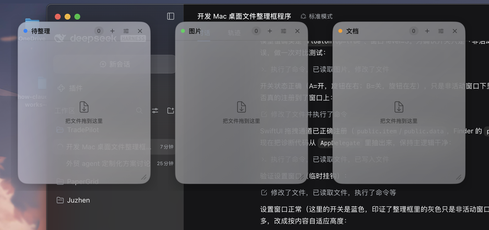
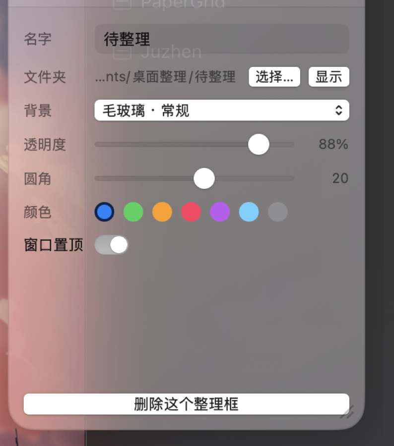
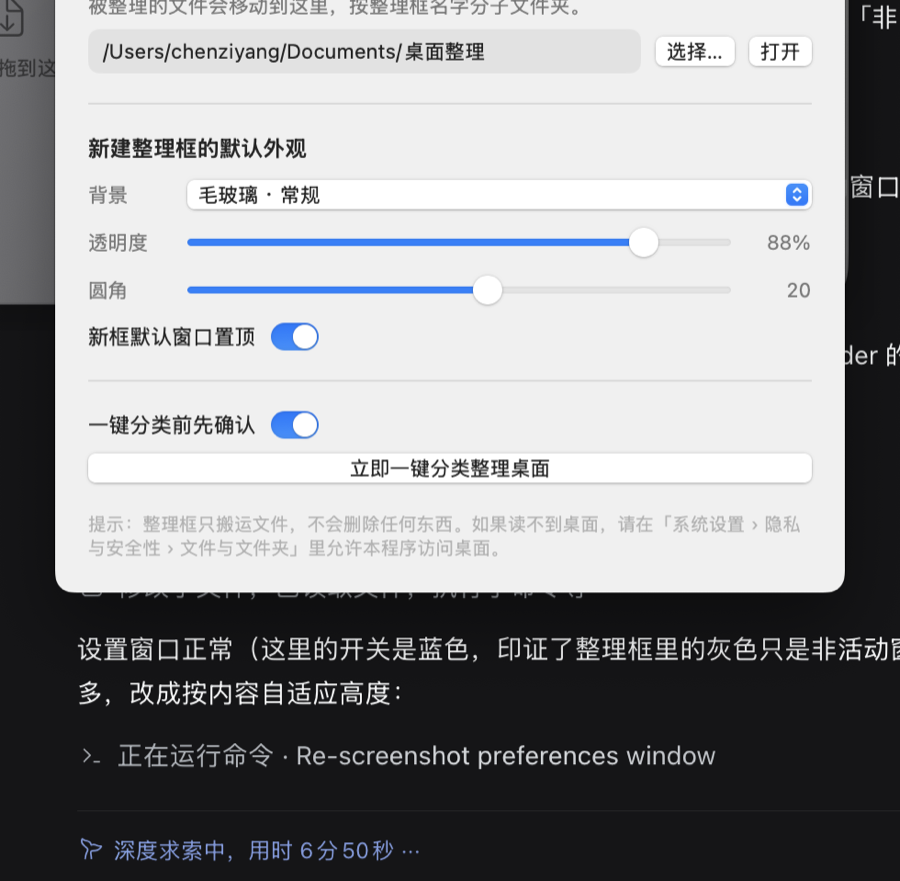

# 桌面整理（DesktopOrganizer）

一个只做一件事的 macOS 小工具：**整理框**。

桌面上摆几个毛玻璃小面板，把文件拖进去就真的被归类到对应文件夹；也可以一键把整个桌面按文件类型自动分类。

原生 Swift + AppKit/SwiftUI 实现，无第三方依赖，无 Electron。



<p align="center">
  
  
</p>

---

## 功能

| 能力 | 说明 |
| --- | --- |
| 新建整理框 | 菜单栏 → 新建整理框；自动找一块不重叠的位置摆放 |
| 删除整理框 | 面板右上角 `×`，或外观设置里的「删除这个整理框」；**只删框，不删文件** |
| 拖拽整理文件 | 把文件/文件夹拖进框 → 真实移动到该框对应的文件夹 |
| 一键分类整理 | 菜单栏 → 一键分类整理桌面；按类型分到 图片/文档/视频/音频/压缩包/安装包/应用/代码/文件夹/其他 |
| 背景效果 | 6 种毛玻璃材质 + 纯色，透明度 15%–100% 可调 |
| 名字 | 双击标题直接改名，或在外观设置里改 |
| 外观 | 圆角 0–36、7 种主题色、窗口置顶开关 |

框里显示的就是该文件夹的真实内容（1.5 秒轮询刷新）。双击文件打开，右键可以「在访达中显示 / 移回桌面 / 移到废纸篓」。

---

## 构建

需要 macOS 14+ 与 Swift 5.10+（命令行工具即可，**不需要完整 Xcode**）。

```bash
cd DesktopOrganizer
./scripts/build-app.sh          # 默认 release
```

产物：`dist/桌面整理.app`，双击即可运行。

启动：

```bash
open "dist/桌面整理.app"
```

---

## 使用

程序是**菜单栏应用**（`LSUIElement`），没有 Dock 图标和主窗口。

- 菜单栏 `⊞` 图标 → 新建整理框 / 一键分类 / 显示隐藏 / 设置
- 面板**标题栏**按住可拖动整个框（不是系统标题栏，是我们画的那条）
- 面板**右下角斜纹**按住可缩放
- 首次启动会自动建三个框：待整理 / 图片 / 文档

默认归档位置：`~/Documents/桌面整理/<整理框名字>/`，可在设置里改。
每个框也可以单独指定任意文件夹。

---

## 设计取舍

- **整理 = 真实移动文件**：不是视觉分组，框里就是磁盘上那个文件夹的内容。
  好处是关掉程序文件也不乱；代价是拖进去的文件确实离开了桌面。
- **重名自动让路**：`报告.pdf` 已存在时，第二个变成 `报告 2.pdf`，绝不覆盖。
- **永远不会删文件**：只有右键菜单里的「移到废纸篓」会动文件（且会二次确认）。
- **自我保护**：
  - 拒绝搬移程序自身所在的目录（所以把 app 放在某个项目目录里，那个目录不会被一键分类搬走）
  - 拒绝把文件夹搬进它自己的子目录
  - 跳过隐藏文件、归档根目录、以及所有整理框的目标文件夹
- **一键分类默认弹确认框**，列出每类多少个文件、要移到哪里。

---

## 诊断

不启动界面也能自检：

```bash
APP="dist/桌面整理.app/Contents/MacOS/DesktopOrganizer"
"$APP" --scan        # 只列出桌面会被怎么分类，不动任何文件
"$APP" --selftest    # 在临时目录里跑一遍完整搬移、重名冲突、保护规则
```

设置这些环境变量会输出窗口自检信息（开发用）：

```bash
DO_DIAG=/tmp/diag.txt            # 窗口几何 / 层级 / 拖拽通道快照
DO_DIAG_SETTINGS=1               # 顺便验证设置面板展开收起
DO_DIAG_PREFS=1                  # 顺便打开设置窗口
```

---

## 权限

第一次整理桌面/文档时，macOS 会要求授权：

**系统设置 › 隐私与安全性 › 文件与文件夹** → 允许「桌面整理」访问「桌面」和「文稿」。

没授权的话，整理框会显示一句提示，而不是静默失败。

---

## 目录结构

```
Sources/DesktopOrganizer/
├── main.swift                    入口（含 --scan/--selftest 分流）
├── App/
│   ├── AppDelegate.swift         菜单栏与启动流程
│   ├── Store.swift               配置模型 + JSON 持久化 + 自动排布
│   ├── BoxWindowManager.swift    配置 ↔ 窗口的同步
│   ├── BoxWindowController.swift 无边框面板：拖动、缩放、拖拽落点、几何
│   ├── BoxPanel.swift            NSPanel 子类
│   └── PreferencesWindowController.swift
├── Views/
│   ├── BoxView.swift             整理框卡片 + 文件格子
│   ├── BoxSettingsView.swift     外观设置
│   ├── BoxUIState.swift          面板展开状态（控制器与视图共享）
│   ├── PreferencesView.swift     全局设置
│   └── VisualEffectBackground.swift  NSVisualEffectView 封装（真毛玻璃）
├── Services/
│   ├── FileMover.swift           搬移、重名让路、跨宗卷降级、自我保护
│   ├── Categorizer.swift         按类型分类 + 一键整理
│   └── FolderModel.swift         文件夹监听 + 图标缓存
└── Support/                      路径、颜色、无头自检
```

配置落在 `~/Library/Application Support/DesktopOrganizer/config.json`。
