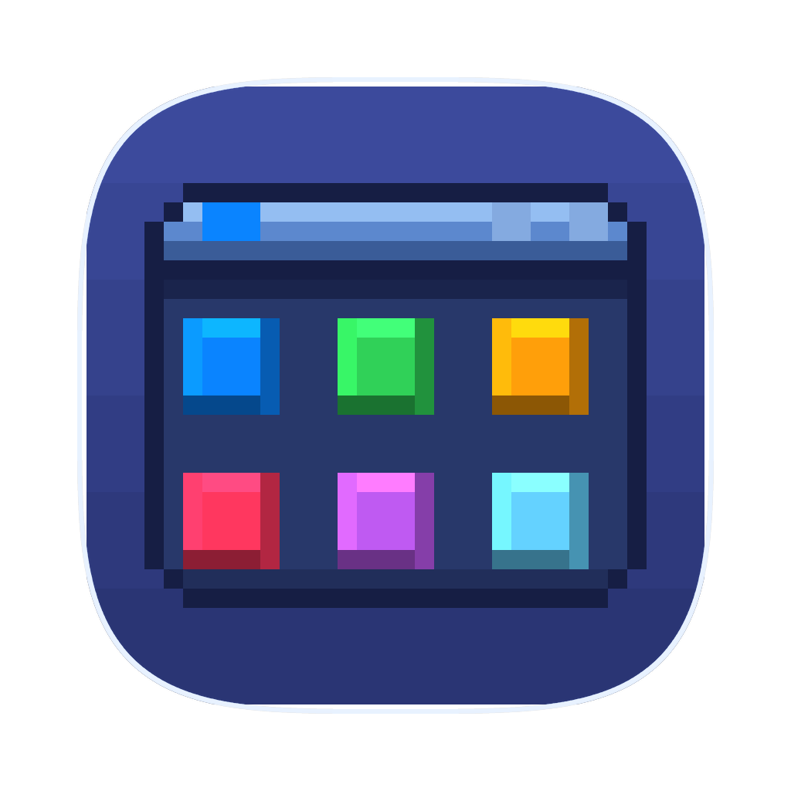
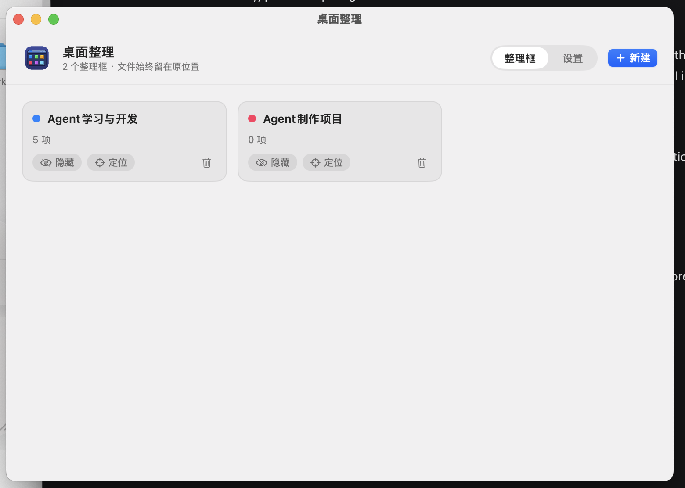
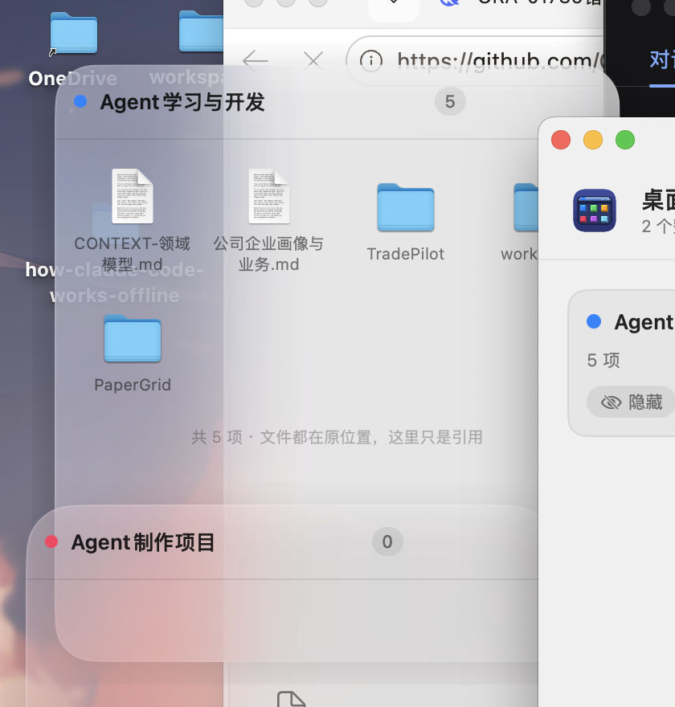
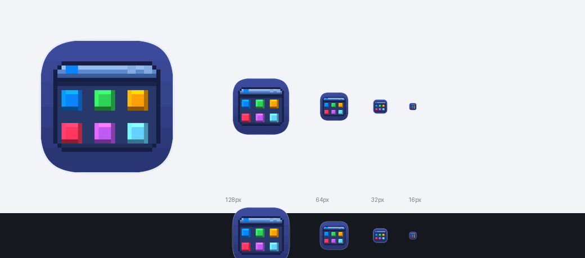

# 桌面整理（DesktopOrganizer）



一个只做一件事的 macOS 小工具：**整理框**。

在桌面上摆几个毛玻璃小面板，把文件拖进去归类。**文件永远不会被移动、改名或删除** ——
整理框只记录路径引用，你的工程路径、相对引用、IDE 工作区都不会被搞乱。

原生 Swift + AppKit/SwiftUI，无第三方依赖，无 Electron。

---

## 最重要的一条：不碰你的文件

| 操作 | 对磁盘上的文件 |
| --- | --- |
| 把文件拖进整理框 | **什么都不做**，只记录路径 |
| 把文件夹拖进整理框 | **什么都不做**，只记录路径 |
| 删除整理框 | **什么都不做** |
| 「按类型归类桌面」 | **什么都不做**，只建立引用 |
| 清空框内条目 | **什么都不做** |
| 条目右键 → 移到废纸篓 | 唯一会动文件的操作，每次二次确认 |

如果某个文件被你在访达里移走或删掉了，整理框会把它标成「已失效」（图标变暗 + ⚠️），
右键移除即可。引用不会自动跟踪文件。

---

## 功能

### 主窗口：一个正经的操作页面



- **整理框页**：所有整理框一览，显示条目数、失效数，可一键隐藏/定位/删除
- **设置页**：新框默认外观、桌面归类、启动行为
- 两页之间是整页滑动切换，不是弹窗
- 有 Dock 图标，点一下就能把窗口叫回来

### 整理框



- **上栏右侧的操作按钮平时隐藏**，鼠标移过去才淡入 —— 平时就是一块干净的玻璃，不打扰
- 齿轮**整页切换到设置页**（窗口尺寸不变），带左右滑动过渡
- **只有双击标题才能改名**，避免拖动或单击误触
- 拖文件进来即归类；右键条目可以打开、在访达中显示、复制路径、移除、移到废纸篓
- 背景效果：6 种毛玻璃材质 + 纯色，透明度 10%–100%，圆角 0–36

### 窗口对齐

拖动整理框靠近另一块整理框或屏幕边缘/中线时，会在 8pt 内**吸附**，
并显示一条淡淡的引导线（吸附点还有一个小方块标记）。支持边对边拼接。

---

## 构建

需要 macOS 14+ 与 Swift 5.10+（命令行工具即可，**不需要完整 Xcode**）。

```bash
cd DesktopOrganizer
./scripts/build-app.sh          # 默认 release
open "dist/桌面整理.app"
```

产物在 `dist/桌面整理.app`。

---

## 使用

启动后：

1. 出现**主窗口**，列出所有整理框
2. 点右上角「+ 新建」建一个整理框，它会淡入出现在屏幕右上角的空位
3. 把文件拖进整理框
4. 鼠标移到整理框上栏**右侧**，出现 `+` `⚙` `✕` 三个按钮

菜单栏也有一个 `⊞` 图标（可在设置里关掉），提供新建、归类、显示/隐藏等快捷入口。

> **从 1.0 升级**：老版本的整理框绑定的是「搬移目标文件夹」。升级后程序会把那个文件夹里
> 已有内容一次性导入成引用（只读不改），之后该字段彻底弃用。不会再有任何搬移行为。

---

## 诊断

不启动界面也能自检：

```bash
APP="dist/桌面整理.app/Contents/MacOS/DesktopOrganizer"
"$APP" --scan       # 只列出桌面会被怎么归类，不动任何文件
"$APP" --selftest   # 断言：加完引用后文件仍在原处；去重；保护规则
"$APP" --snaptest   # 断言：吸附几何（阈值内吸附、阈值外不吸附、引导线）
```

开发用的窗口自检：

```bash
DO_DIAG=/tmp/diag.txt      # 窗口几何 / 层级 / 拖拽通道快照
DO_DIAG_PAGE=1             # 顺便把第一个整理框切到设置页
DO_DIAG_MAINSETTINGS=1     # 顺便把主窗口切到设置页
```

---

## 目录结构

```
Sources/DesktopOrganizer/
├── main.swift                       入口（--scan / --selftest / --snaptest）
├── App/
│   ├── AppDelegate.swift            主菜单、菜单栏图标、启动流程
│   ├── MainWindowController.swift   主管理窗口
│   ├── Store.swift                  数据模型 + 迁移 + JSON 持久化 + 自动排布
│   ├── BoxWindowManager.swift       配置 ↔ 窗口同步、吸附辅助
│   ├── BoxWindowController.swift    整理框窗口：拖动/缩放/吸附/条目操作
│   ├── BoxPanel.swift               NSPanel 子类
│   └── SnapGuides.swift             吸附计算 + 引导线浮层
├── Views/
│   ├── MainView.swift               主窗口：整理框列表
│   ├── SettingsPage.swift           主窗口：设置页
│   ├── BoxView.swift                整理框：上栏悬停、条目网格
│   ├── BoxSettingsPage.swift        整理框：设置页
│   ├── BoxUIState.swift             页面/悬停/拖拽状态
│   └── VisualEffectBackground.swift 真毛玻璃（自己裁圆角）
├── Services/
│   ├── BoxItemsModel.swift          引用解析、失效检测、图标缓存
│   ├── FileActions.swift            打开/显示/复制路径/废纸篓
│   └── Categorizer.swift            按类型归类（只读）
└── Support/                         路径、颜色、无头自检

tools/make_icon.py                   生成像素风应用图标
```

配置落在 `~/Library/Application Support/DesktopOrganizer/config.json`。

---

## 图标

```bash
python3 tools/make_icon.py     # 重新生成 Resources/AppIcon.icns 和预览图
```

图案画在 32×32 的经典像素网格上，NEAREST 放大 25 倍保证硬边；底衬是 macOS 标准的
squircle 轮廓（824×824 内容区），放进 Dock 不会突兀。背景用 6 段色带渐变 —— 在
32px 这个尺度上，色带比 Bayer 抖动干净得多。



---

## 权限

首次拖入桌面/文稿里的文件时，macOS 会要求授权：

**系统设置 › 隐私与安全性 › 文件与文件夹** → 允许「桌面整理」访问「桌面」和「文稿」。
